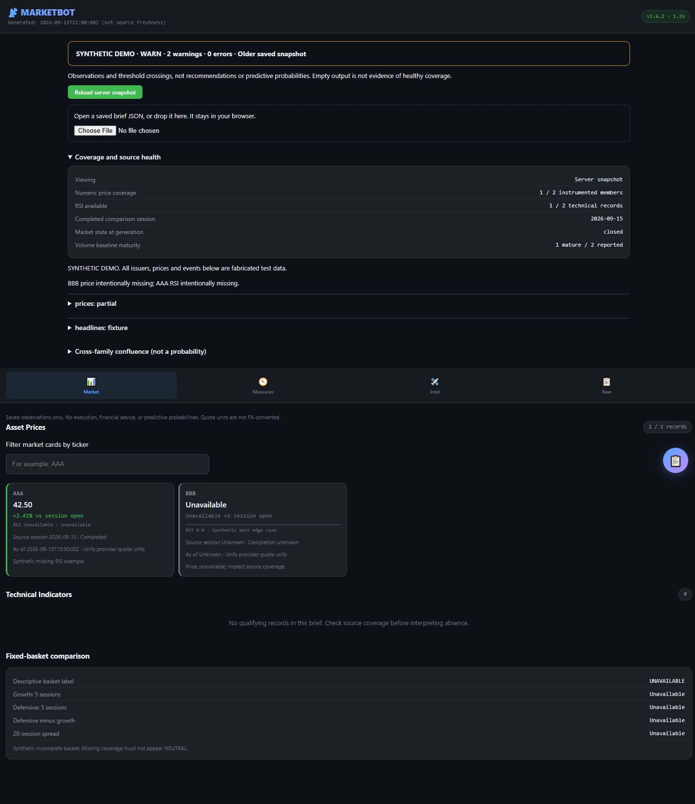

# Public Market Data & Observability Bot

An open-source, local-first data collection and observability pipeline for public market information. It gathers public headlines, filings, price/volume measurements, social context, options statistics, earnings dates, and clinical/regulatory events into a versioned daily brief for human or software review.

Run `python marketbot.py demo` to explore a saved synthetic brief without keys or
third-party packages. It deliberately includes missing data so you can see how
coverage and uncertainty are represented.

<details>
<summary>Preview the synthetic viewer</summary>



This is fabricated demonstration data using a historical export schema, not a
live market snapshot or a performance record. The version badge describes the
loaded brief's pipeline era.

</details>

## Project scope

This repository is public data tooling, not a market-advisory, research-call, or execution service. It does not provide paid or free trading signals, buy/sell/hold recommendations, security rankings, target prices, personalized suitability assessments, position sizing, portfolio management, brokerage connectivity, or order placement.

Labels such as `RISK_ON`, threshold tags, and legacy JSON keys containing `signal` or `alert` are deterministic measurement classifications retained for schema compatibility. They do not express a recommendation, expected return, trading intent, inferred causality, or view about what any person should do.

The neutral scope is a product-design constraint, not legal advice or a representation that a particular operator, deployment, or downstream use is registered, exempt, or compliant in any jurisdiction. Anyone publishing reports or opinions about securities should obtain advice appropriate to their own activities and location.

## Open-source and provider policy

- The code, schemas, deterministic fixtures, and offline verification workflow are published under the MIT License.
- Prefer official filings, regulator or exchange publications, public RSS/HTML sources, keyless endpoints, and auditable open-source libraries for the default pipeline.
- Optional commercial data providers remain replaceable adapters; missing credentials must not disable the core export or offline tests.
- Keep collection, provenance, health, timestamp, and exclusion logic inspectable. Do not introduce opaque scoring sold as a signal service.
- Generated data remains local by default. The repository does not operate a hosted recommendation feed or subscriber tier.

## Outputs

A successful export writes:

- `daily_brief.json` — typed schema 2.8 data for scripts and dashboards; additional uses require source-purpose approval
- `daily_brief.txt` — human-readable rendering of the same run
- `lean_brief.json` — the lean brief, a labelled projection (about 5% of the full size) for an operator who chooses to share a brief with a language model: market sections, summary, field conventions, compact health warnings and reading rules, without per-source diagnostics or data-quality records. It is not the canonical record and is not for redistribution; a dated copy of each run is kept in `lean_briefs/` for 7 days (measured from each brief's `generated_at`), while the full briefs remain in the permanent archive; sending source content to a model remains the operator's source-purpose decision. `python lean_brief.py <brief.json>` projects any saved brief.
- `briefs/YYYY-MM-DD/` — point-in-time snapshots
- `archive/briefs/` — append-only canonical JSON copies

An optional independent archive mirror can be configured with `BRIEF_ARCHIVE_MIRROR_DIR`. Generated artifacts, state, logs, databases, and credentials are ignored by Git.

The JSON includes source health, run context, timestamps, coverage gaps, retries, fallbacks, and data-quality exclusions. Review `health` before relying on any section.

## Current pipeline

This public research-tooling checkout implements the current collection pipeline (`schema_version=2.8`,
`pipeline_version=2.6.5`):

- publisher-diverse headlines from official SEC, Federal Reserve, FDA, and Nasdaq feeds; optional FMP and Alpha Vantage adapters; bounded GDELT discovery; capped Google News fill; and explicit universe, macro, and impact-gated discovery lanes
- separate ordered universes: 29 instrumented/signal-eligible tickers and 13
  editorial-only tickers, producing 42-name headline coverage without expanding
  price, technical, options, earnings, per-ticker SEC/social, or signal collection
- watchlist prices and completed-session technical measurements via yfinance
- SEC EDGAR 8-K and Form 4 collection with retry/failure metadata
- one run-scoped OpenInsider `ALL` acquisition (30 days, at most 500 rows)
  shared by narrative and cluster consumers, with a shared session, bounded
  connection/timeout retries, a source rate gate, typed failure health, and a
  last-known-good narrative-only cache; if HTTPS is specifically refused, one
  port-80 HTTP attempt may supply visibly unauthenticated narrative only
- Reddit RSS, ApeWisdom, Hacker News, RSS, Substack, Nitter, and Google News narrative inputs
- completed-session put/call statistics and short-dated contract volume/open-interest anomalies
- earnings dates, ClinicalTrials.gov changes, FDA event extraction, and cash-runway measurements
- sector-relative returns, VIX term structure, and configured instrument return spreads
- exact 48-hour cross-family confluence, transactional state, atomic output, immutable archives, and failure-closed top-level stages
- a separate outcome ledger for measuring +1/+5/+20 completed-session behavior without changing production collection rules

Acquisition providers and underlying publishers are separated. Aggregators and social sources are discovery/context inputs; they do not establish filings, regulatory outcomes, trade direction, or issuer facts.

OpenInsider live rows must have a parseable, non-future filing date inside the
cluster lookback before they can become cluster evidence. Cached rows are
explicitly stale and may supply narrative context only; they never enter
insider clusters or confluence. Plaintext HTTP fallback rows are likewise
marked `signal_eligible=false`, never written to the trusted cache, and blocked
from clusters, signals, state, confluence, and the ledger. When secure live
OpenInsider rows cannot produce a cluster, SEC EDGAR Form 4 remains the cluster
fallback.

## Try the viewer without credentials

```sh
python marketbot.py demo
python marketbot.py doctor
python marketbot.py plan --universe profiles/us-core.example.json
python marketbot.py inspect path/to/daily_brief.json
python marketbot.py diff path/to/previous.json path/to/current.json
python marketbot.py packet path/to/previous.json path/to/current.json --subject ALFA --note
```

`demo` opens the local viewer over the bundled synthetic fixture. It does not
write a new export or contact providers. The other commands inspect local data
without provider requests. Saved JSON files are imported inside your browser.
Health, missing values, source timestamps and coverage appear before
interpretation. `doctor` shows credential presence only, never values.

`packet` answers "what changed for this issuer since my previous brief, and
what can I verify?" from the evidence history (`python -m event_history
import`). Each change comes with:

- its exact source, version, archive file and JSON pointer;
- its limitation or conflict;
- the next evidence that is missing.

Amendments correct only the figures they name. Reports that repeat a
disclosure count as coverage, not as independent confirmation. Missing
providers are shown as coverage gaps, never as "nothing happened". Price
context is descriptive and never attributed to a change. `--save note.md`
writes the four-part note to a file you choose.

The packet is an unvalidated prototype until the
[falsification study](docs/study/CHANGE_PACKET_STUDY.md) has been run.

[Optional profiles and isolated workspaces](docs/WORKSPACES.md) let you try an
explicit 1–64 instrument universe without mixing legacy state or archives.
Profile exports use schema **2.9**, carry the normalized profile, and disable the
legacy editorial expansion. Default runs preserve schema **2.8** and OMNI-02.
Both use measurement era **2.6.5**; historical 2.6/2.7/2.8 exports, including
the 2.6.4 era, remain readable.
The 45-symbol profile is an example, not verified coverage or a portfolio.

Basket and pair returns require exact completed-session windows and full fixed
membership. Missing is unavailable, not neutral. Empty price responses leave
ledger outcomes pending for a later retry. Directional statistics have their own
sample gate and disclose overlapping horizons and same-session dependence.

Era 2.6.5 binds each ledger return window to one immutable price acquisition,
so overlapping provider revisions cannot combine endpoints from different
adjustment vintages. Cash-runway measurements expose missing operating cash flow,
period mismatch, currency ambiguity and missing debt as typed unknowns; they do
not use an infinite-runway sentinel or treat missing financials as zero.

The six-scenario Windows launcher regression checks real exit-code handling:
stderr warnings alone do not fail a run. Profile-aware scheduling remains a
future gate; use the profile CLI manually until that path is implemented.

For a browser-only synthetic preview, run `python serve_dump.py --demo` and open
the printed loopback URL. The fixture is marked synthetic in the viewer and no
provider request is made. You can also import a saved brief with the file picker
or drag-and-drop area; the file is read locally by the browser.

## Quickstart

Requirements:

- Python 3.11 or 3.12
- network access to the configured public sources
- a real SEC EDGAR contact string

```powershell
git clone https://github.com/Rexyysilent/stock-market-bot.git
cd stock-market-bot
py -3.11 -m venv .venv
.\.venv\Scripts\activate
python -m pip install --require-hashes -r requirements.lock
copy .env.example .env
```

On macOS or Linux:

```sh
git clone https://github.com/Rexyysilent/stock-market-bot.git
cd stock-market-bot
python3 -m venv .venv
. .venv/bin/activate
python -m pip install --require-hashes -r requirements.lock
cp .env.example .env
```

Edit `.env` and set `SEC_USER_AGENT`. Optional API keys and source switches are documented in `.env.example`.

Before a live export, check configuration without printing secret values:

```powershell
python marketbot.py doctor
```

Run an export:

```powershell
python export_for_gemini.py
```

Serve the local dashboard:

```powershell
python serve_dump.py
```

The optional dashboard defaults to `127.0.0.1`. A trusted-LAN listener requires
explicit `--host` configuration; there is no application authentication or TLS.
The viewer displays saved observations, not a live market feed. See [WORKSPACES](docs/WORKSPACES.md) for controls and limitations.

Common setup failures:

- If a locked install reports a hash or version mismatch, confirm that the
  interpreter is Python 3.11 or 3.12 and recreate the virtual environment.
- If an export reports SEC configuration failure, set a real `SEC_USER_AGENT`
  identifying the operator; do not copy the example value unchanged.
- If the viewer shows no brief, use `--demo`, point `--data-dir` at a directory
  containing `daily_brief.json`, or generate an export first.
- A `WARN` export can contain usable partial data. Read `health.sources`, source
  timestamps, and coverage counts; an absent row is not a zero measurement.

## Configuration

`config.py` contains a sample U.S.-market universe, aliases, source lists, and descriptive thresholds. Forks should replace the sample universe with their own neutral configuration. Do not commit private watchlists, sizing, holdings, broker data, or credentials.

Key environment variables:

- `SEC_USER_AGENT` — required SEC EDGAR identification
- `REDDIT_CLIENT_ID` / `REDDIT_CLIENT_SECRET` — optional PRAW credentials
- `FMP_API_KEY` / `ALPHA_VANTAGE_API_KEY` — optional headline providers
- `HEADLINE_GDELT_ENABLED` / `HEADLINE_GOOGLE_FALLBACK_ENABLED` — headline source controls
- `EDITORIAL_COVERAGE_MODE=off|shadow|active` — defaults to `shadow`; activation is manual
- `FOCUS_TICKER` — optional evidence-gated editorial focus request
- `BRIEF_ARCHIVE_DIR` — canonical append-only archive
- `BRIEF_ARCHIVE_MIRROR_DIR` — optional independent mirror; blank disables it
- Discord variables — optional local bot surface

## Editorial coverage rollout

`SIGNAL_ELIGIBLE_TICKERS` is the existing ordered 29-name instrumented set.
`EDITORIAL_ONLY_TICKERS` contains `MRNA`, `VRTX`, `BEAM`, `RARE`, `CEG`,
`LEU`, `BWXT`, `GEV`, `MP`, `NVDA`, `RKLB`, `HOOD`, and `MRK`.
`EDITORIAL_COVERAGE_TICKERS` is their ordered 42-name concatenation. The
deprecated `ALL_TICKERS` compatibility alias remains the original 29.

The earlier 41-name cohort is preserved as a legacy contract. MRK is appended,
not substituted for HOOD. This public sample configuration does not imply holdings.

Coverage mode controls mapping/focus and the explicitly declared FMP payload:

- `off`: only core names establish universe identity or editorial focus;
  pre-existing outside-universe discovery remains available.
- `shadow` (default): the 13 are mapped and scored in bounded diagnostics,
  while selection/focus use the same legacy interpretation as off mode.
  Existing discovery stories are not erased by shadow mapping.
- `active`: fresh, valid evidence for the 13 may enter the universe headline
  lane and PR3 editorial focus. It still carries `signal_eligible=false` and
  can never enter alerts, confluence, baseline state, or the outcome ledger.

GDELT stays at the same three query strings. FMP requests 27 symbols in off/shadow
and 40 in active. It makes one primary request and may make a second on a 402
entitlement fallback; that narrower FMP-articles corpus is labeled explicitly.
Watcher/SEC targets remain 29; options/earnings target 17. ApeWisdom still uses
five all-stocks pages plus one 4chan page. Targets do not guarantee data availability.

`coverage_policy.py` records versioned capabilities and source-purpose rules.
Unknown rights do not authorize new raw-body storage, model processing or
redistribution. Existing local metadata collection is retained, not certified as
a license grant. Registry/policy fingerprints and exact targets are exported.

Keep shadow mode until manual approval. Ten eligible scheduled exports are a
minimum observation period, not ten independent semantic tests. Also require
meaningfully exercised issuer cases, reviewer evidence and all of the following:

- zero false issuer mappings;
- zero signal, state, confluence, or ledger leakage;
- identical off/shadow acquisition payloads and no unapproved request growth;
- schema-valid, byte-identical canonical and archive JSON copies;
- no new hard source errors; and
- median runtime no more than 15% above the preceding successful baseline.

Policy leakage or defective implementation invalidates the relevant evaluation.
Mandatory-source gaps pause the affected gate; optional-source degradation is
reported separately. No automatic counter or activation is implemented here.
Neutral wording is a scope constraint, not a legal exemption.

## OMNI-02 metadata intake (shadow)

`EVIDENCE_INTAKE_MODE=shadow|off` defaults to `shadow`. Existing headline
acquisitions retain bounded, purpose-approved metadata before selection, including
candidates excluded by the five-headline cap. The optional audit appears at
`data_quality.headline_pool.evidence_intake`; it cannot promote a candidate into
headlines, focus, signals, state, or the ledger. Disabling intake restores the
previous output surface; additive provider gap counters remain available.

Replay an export containing that field with:

```powershell
python scripts/replay_evidence_intake.py path/to/daily_brief.json
```

Replay checks retained selection metadata against the matching selector and coverage
policy, without fetching sources. It is not raw-response/parser replay. No bodies
or summaries are newly stored, no rights to model use or redistribution are granted,
and no independent polling schedule or additional vendor requests are introduced.
Incomplete captures explicitly refuse exact replay. See the OMNI-02 handoff in
`docs/PUBLIC_PARITY.md` for acceptance limits and intentional public boundaries.

## Timestamp and failure policy

The exporter creates one immutable UTC/NYSE `run_context`. Daily measurements use the latest completed market session; missing source time remains null rather than being replaced with run time. `as_of`, `observed_at`, scheduled event time, and effective session are distinct.

Unexpected stage, archive, or mutable-state failures produce a diagnostic `ERROR` artifact, roll state back, and return non-zero. Expected provider degradation remains visible as `WARN` with partial usable data where possible.

See [docs/EXPORT_SCHEMA.md](docs/EXPORT_SCHEMA.md) for the contract and [docs/ROADMAP.md](docs/ROADMAP.md) for public development priorities.

## Scheduler and outcome ledger

Windows users can install the UTC-gated current-user task:

```powershell
.\install_scheduler.ps1
.\run_scheduled.ps1 -ValidateOnly
```

The launcher first checks this machine's clock against network time (NTP, with an HTTPS `Date` fallback) and refuses the run if it is more than 5 minutes off or cannot be verified, because every timestamp the stages write comes from the local clock; the result is kept in `state/clock_check.json`. It then runs the exporter and matures the separate outcome ledger. Ledger commands are research diagnostics, not performance promises or execution logic:

```powershell
python -m ledger ingest
python -m ledger update
python -m ledger rebuild
python -m ledger import-legacy
```

## Evidence history (sidecar)

`python -m event_history import` indexes archived briefs into a separate,
append-only database (`history/event_history.db`). It reads archives and never
writes them, the ledger, state, or any collector, and makes no network calls.

- One archive identity per exact byte content; every path a copy was found at
  is kept. Documents of an unknown schema are quarantined, not guessed.
- SEC filing rows and validated OMNI-02 intake records become evidence versions
  with JSON pointers back into the archive. Schemas 2.8/2.9 are native; 2.0 and
  2.5-2.7 have documented legacy adapters. A zone-less `generated_at` (2.0) is
  not established knowledge time, so strict views exclude those sightings.
- Capture policy stays with each sighting as the archive recorded it; today's
  policy is never applied to an older capture.
- Interpretation (event anchors, memberships, amendments, contradictions,
  aliases) is appended with a decision time and a registered resolver. Cycles,
  out-of-order corrections and decisions made before a resolver existed are
  refused. Ambiguous links stay candidates; nothing is merged automatically.
- `view --cutoff T` is the as-operated view: evidence known by T, interpreted
  only by decisions made by T. `--mode retrospective` applies later resolvers and
  is labelled as a reconstruction, not what the system knew. Conflicting values
  keep their attributions; nothing is voted on or averaged, and independence of
  origins is not assessed. A date with unknown timezone never becomes UTC
  midnight: ordering it against an instant on the same day abstains.
- `annotate <archive_sha> --observed-not-before T --reason ...` records that an
  archive's own time label was earlier than its real capture (for example a
  skewed host clock); views then treat its contents as known from T.

```powershell
python -m event_history import
python -m event_history anchor
python -m event_history view --cutoff 2026-09-23T00:00:00Z
python -m event_history status
```

## Tests

Run the same deterministic, network-free suite used by CI:

```powershell
python scripts/run_offline_checks.py
python scripts/validate_export_schema.py
```

The separate dashboard transport checks use only a loopback listener with
synthetic temporary files. CI runs both suites as one bounded step; they are
excluded from the network-free suite:

```powershell
python -m unittest -v test_dashboard_server test_dashboard_security
```

Syntax check:

```powershell
python -m compileall -q export_for_gemini.py openinsider_agent.py signals.py timeutil.py stateutil.py agents ledger scripts
```

CI repeats those checks on Python 3.11 and 3.12, installs only from hash-locked dependency files, audits runtime dependencies, and scans tracked files for secrets. `requirements.txt` and `requirements-ci.txt` remain the readable dependency inputs.

See [CONTRIBUTING.md](CONTRIBUTING.md) for change and fixture guidance. Report a
vulnerability privately through [GitHub Security Advisories](https://github.com/Rexyysilent/stock-market-bot/security/advisories/new)
as described in [SECURITY.md](SECURITY.md); do not open a public issue for it.

## Responsible use

- Treat all output as fallible source aggregation and deterministic measurements.
- Check licensing, terms, timestamps, and source health before redistributing data.
- Do not infer option trade direction from CALL/PUT type or estimated notional.
- Do not treat a headline count, social mention, technical label, or outcome sample as a recommendation.
- No automated order placement is implemented or authorized by this project.
- Do not market forks or generated artifacts as guaranteed, actionable, or regulator-approved signals.
- Users remain responsible for professional advice and laws or regulations applicable to their own activities.

## License

MIT License. See [LICENSE](LICENSE).
